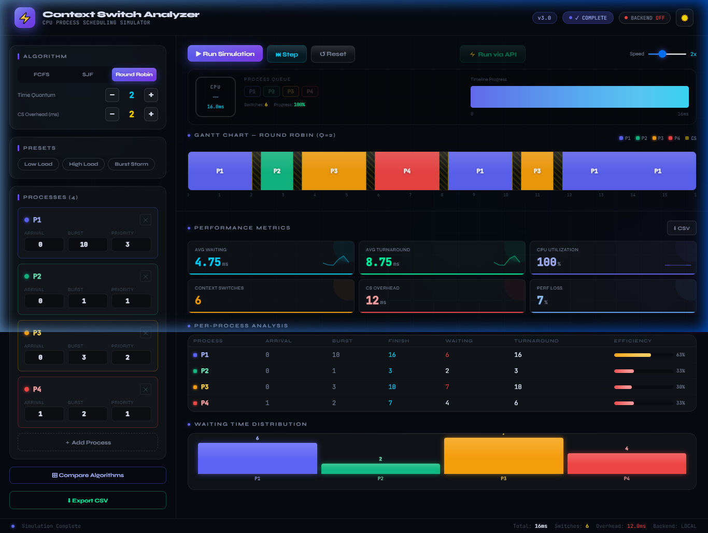
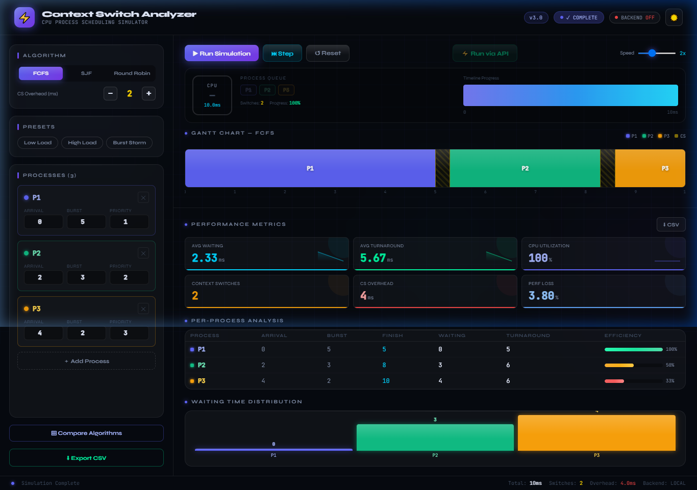
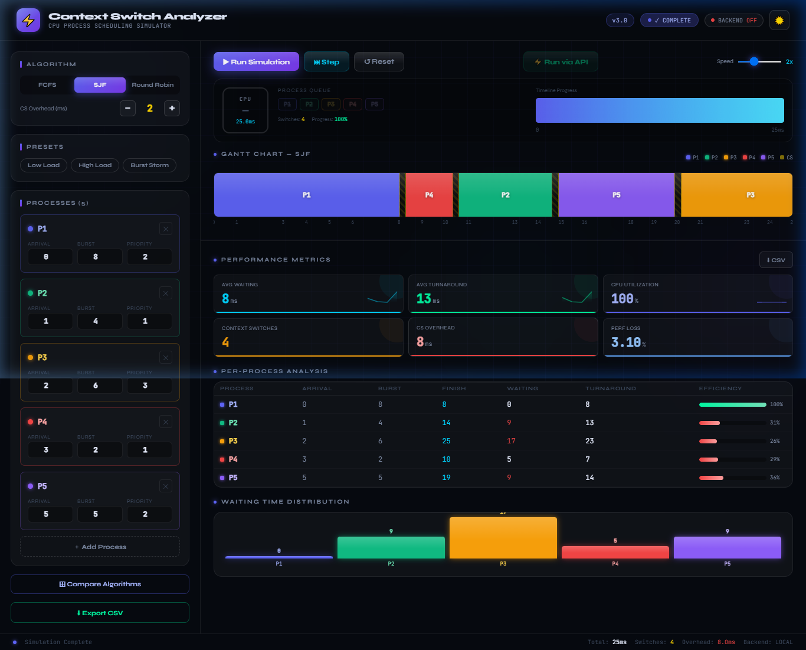

# ⚡ Context Switching Analyzer

A performance-analysis tool and scheduling simulator that quantifies CPU context-switching overhead and measures system-level resource allocation under process contention.

## 📊 Interactive Simulation Dashboard

## 🚀 Core Features
* **Interactive Simulation Dashboard**: Visualize CPU scheduling in real-time.
* **Supported Algorithms**: Simulates First-Come-First-Serve (FCFS), Shortest Job First (SJF), and Round Robin (RR) algorithms. The simulator dynamically adapts Gantt chart visualizations and calculates exact performance loss.

| FCFS Scheduling | SJF Scheduling |
| :---: | :---: |
|  |  |

* **Gantt Chart Visualizations**: Dynamically adapts and visualizes process execution timelines.
* **Exact Metrics Calculation**: Calculates key scheduling metrics, including:
  * **Context Switches**: Total number of times the CPU switches between active processes.
  * **CS Overhead**: Exact millisecond delay introduced by process swapping.
  * **Performance Loss**: Percentage of overall CPU time consumed by context switching.
  * **Turnaround & Waiting Time**: Granular per-process efficiency metrics.

## 🛠️ Tech Stack
* **Backend**: Python, FastAPI, Pydantic
* **Frontend**: HTML, JavaScript
* **API Communication**: RESTful endpoints with CORS enabled

## 📁 Project Structure
* `context-Switching-2/backend/`: Contains the FastAPI application and simulation logic (`main.py`).
* `context-Switching-2/frontend/`: Contains the interactive dashboard (`Context-Switch.html`).
* `context-Switching-2/screenshots/`: Example visuals of the dashboard.

## ⚙️ How to Run
1. Navigate to the `context-Switching-2/backend` directory.
2. It is recommended to create a virtual environment first:
   * **Windows**: `python -m venv venv` and activate with `venv\Scripts\activate`
   * **Mac/Linux**: `python3 -m venv venv` and activate with `source venv/bin/activate`
3. Install the dependencies: `pip install fastapi uvicorn pydantic`.
4. Run the backend server: `uvicorn main:app --reload --port 8000`.
5. Open `context-Switching-2/frontend/Context-Switch.html` in your web browser to access the dashboard.
